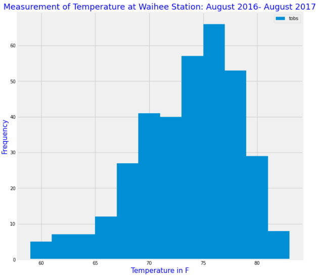

# SQLAlchemy-challenge
HW 10 SQL Alchemy UofO Bootcamp Data Analytics

##  Surf's Up

I've decided to treat myself to a long holiday vacation in Honolulu, Hawaii! I've decided I need to do some climate analysis on the area to help with my trip planning.

###  Climate Analysis and Exploration

 To begin, I'll be using Python and SQLAlchemy to do basic climate analysis and data exploration of my climate database. All the following analysis will be completed using SQLAlchemy ORM queries, Pandas, and Matplotlib.

 I will be using the following:

 * Use the provided starter notebook and hawaii.sqlite files to complete my climate analysis and data exploration.

* Use SQLAlchemy create_engine to connect to my sqlite database.

* Use SQLAlchemy automap_base() to reflect my tables into classes and save a reference to those classes called Station and Measurement.

* Link Python to the database by creating an SQLAlchemy session.

### Analysis
1. Precipitation Analysis

Using the most recent date in the data set, I've retrieved the last 12 months of precipitation data by querying this. Only using the date and precipitation values, I loaded the query results into a Pandas DataFrame and set the index to the date column. Once the dataframe values were sorted by date, I plotted the results using the DataFrame plot method.

2. Station Analysis

I designed a query to calculate the total number of stations in the dataset. Then designed a query to find the most active stations. Once I listed the stations and observation counts in descending order. I found the station id that had the highest number of observations. Using the most active station id, calculate the lowest, highest, and average temperature.

The next step I designed a query to retrieve the last 12 months of temperature observation data (TOBS). Filtering by the station with the highest number of observations. Then queried the last 12 months of temperature observation data for this station. Below image is the plotted results as a histogram with bins=12.

### Climate App

 Now that I have completed the initial analysis, I have designed a Flask API based on my developed queries. I used the below Routes.

#### Routes
* `/`

  * Home page.

  * List all routes that are available.

  

* `/api/v1.0/precipitation`

  * Converted the query results to a dictionary using `date` as the key and `prcp` as the value.

  * Return the JSON representation of the dictionary.

  

* `/api/v1.0/stations`

  * Return a JSON list of stations from the dataset.

  

* `/api/v1.0/tobs`
  * Query the dates and temperature observations of the most active station for the last year of data.

  * Return a JSON list of temperature observations (TOBS) for the previous year.

  

* `/api/v1.0/<start>` and `/api/v1.0/<start>/<end>`

  * Return a JSON list of the minimum temperature, the average temperature, and the max temperature for a given start or start-end range.

  * When given the start only, calculate `TMIN`, `TAVG`, and `TMAX` for all dates greater than and equal to the start date.

  * When given the start and the end date, calculate the `TMIN`, `TAVG`, and `TMAX` for dates between the start and end date inclusive.

 
